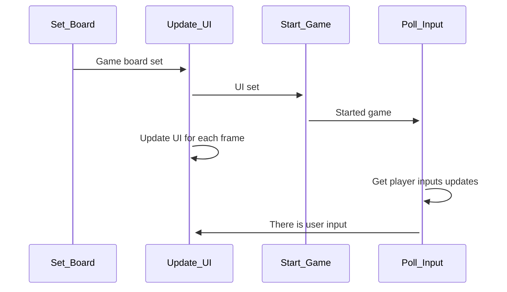
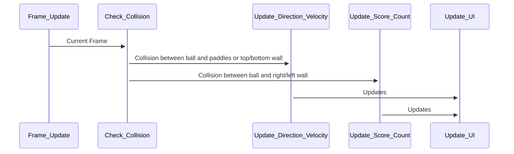
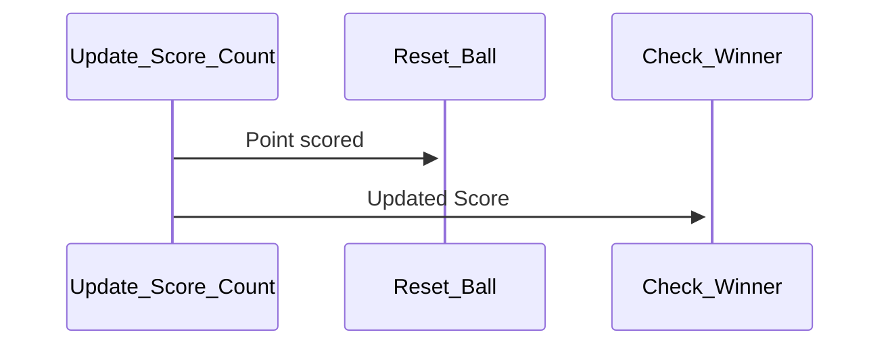

# Interaction Sequences

## Startup Sequence

```mermaid
sequenceDiagram
    Set_Board->>+Update_UI: Game board set
  Update_UI->>+Start_Game: UI set
  Start_Game->>+Poll_Input: Started game
  Update_UI->>+Update_UI: Update UI for each frame
  Poll_Input->>+Poll_Input: Get player inputs updates
  Poll_Input->>+Update_UI: There is user input
```

```mermaid
sequenceDiagram
  Frame_Update->>+Check_Collision: Current Frame
  Check_Collision->>+Update_Direction_Velocity:Collision between ball and paddles or top/bottom wall
  Check_Collision->>+Update_Score_Count:Collision between ball and right/left wall
  Update_Direction_Velocity->>+Update_UI: Updates
  Update_Score_Count->>+Update_UI: Updates
```

```mermaid
sequenceDiagram
  Update_Score_Count->>+Reset_Ball: Point scored
  Update_Score_Count->>+Check_Winner: Updated Score
```

## Movement Initiation

-describe-how-modules-interact-to-make-the-ball-move

## One score

-describe-how-the-modules-interact-to-record-scores
