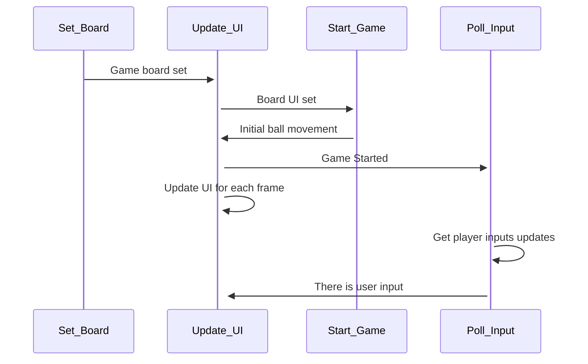
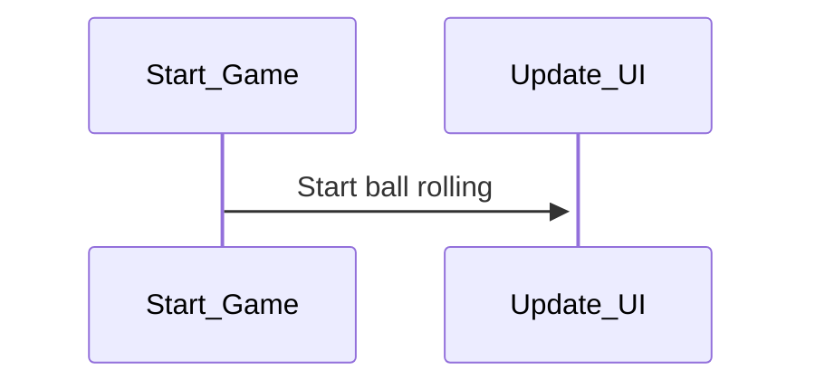
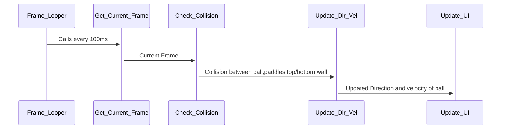
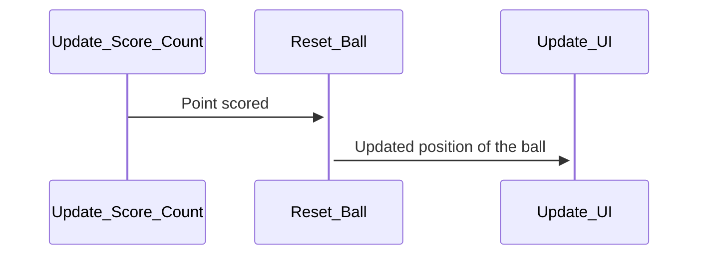
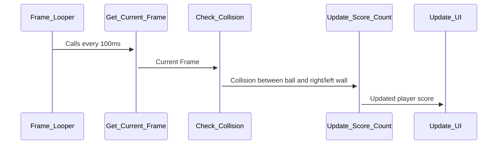
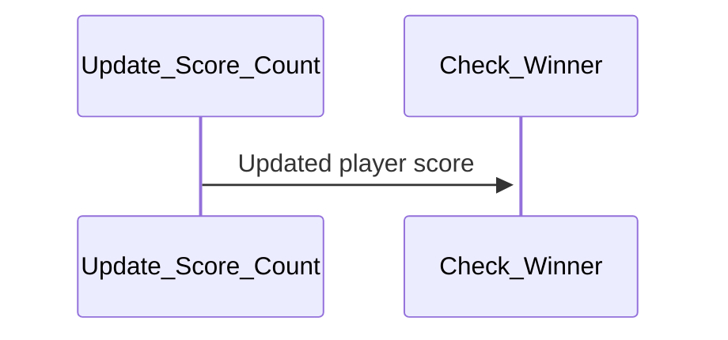

# Interaction Sequences

## Startup Sequence

### Module interaction to start the game

## Movement Initiation

### Module interaction to move the ball

## One score

### Module interaction to record the scores of player

